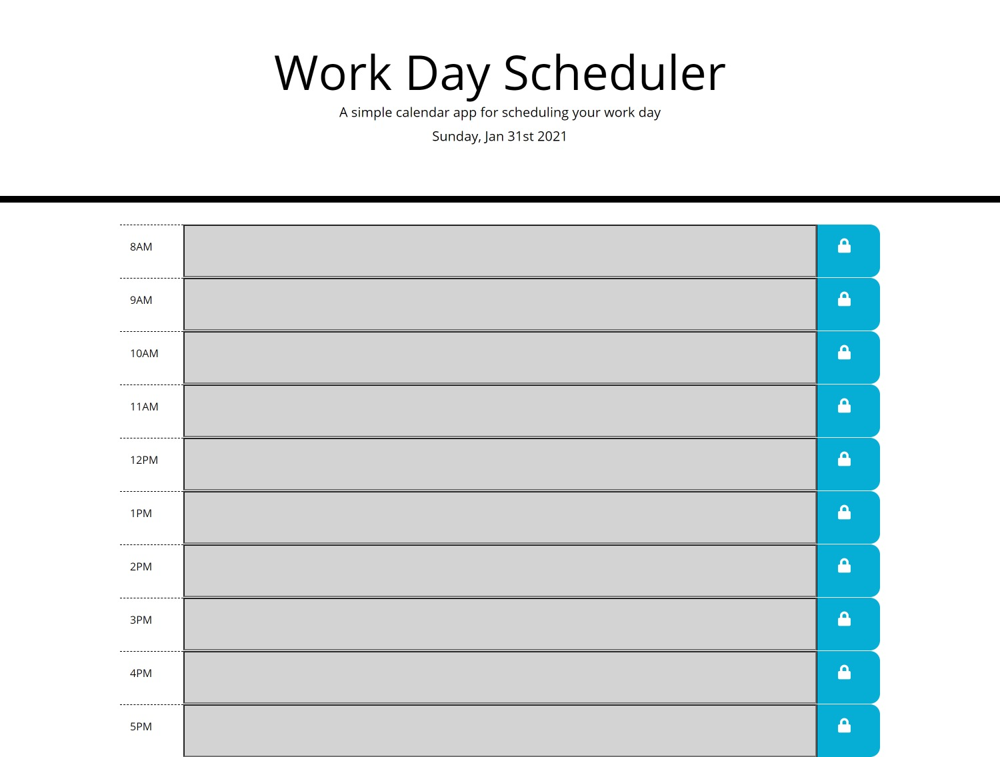

# Work Day Scheduler

Project URL: https://thrazer675.github.io/workday-scheduler/

## Description

Application that allows users to view a standard workday by the hour, and input events into each hour block. The input block colors change depending on time (past, present, or future). Users can save their events to local storage so as to retain them for later use.

